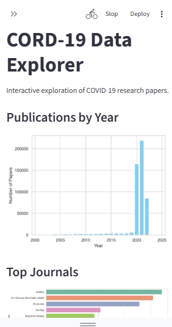
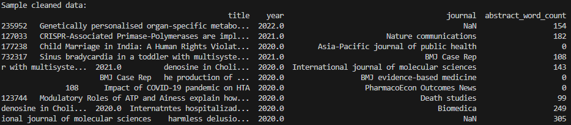

# CORD-19 Data Explorer

Interactive Streamlit app for exploring COVID-19 research papers from the CORD-19 dataset.

## Features

- **Publications by Year**: Bar chart showing research trends over time
- **Top Journals**: Visualization of most active journals
- **Word Cloud**: Visual representation of common terms in paper titles
- **Sample Data**: Preview of filtered dataset
- **Interactive Filters**: Year range slider for data exploration

## Screenshots

### Web App



### Initial Data Cleaning



## Prerequisites

```bash
pip install streamlit pandas matplotlib seaborn wordcloud
```

## Setup

1. Download `metadata.csv` from [CORD-19 Kaggle dataset](https://www.kaggle.com/allen-institute-for-ai/CORD-19-research-challenge)
2. Place the file in `data/metadata.csv` (see data folder README)
3. Run the app:

```bash
streamlit run cord19_app.py
```

## App Structure

- **Data Loading**: Cached loading with date parsing and cleaning
- **Sidebar**: Year range filter controls
- **Main Panel**: Multiple visualizations and data preview
- **Error Handling**: Graceful handling of missing data files

## Usage

1. Open the app in your browser (usually `http://localhost:8501`)
2. Use the sidebar slider to filter by year range
3. Explore different visualizations that update automatically
4. Check the sample data table for filtered results

## File Requirements

- `app.py` - Main application file
- `data/metadata.csv` - CORD-19 dataset (download required)
- `screenshots/` - App screenshots (optional)

**Note**: The app will display an error if `metadata.csv` is not found in the data folder.
